Small Frontend App for managing my other project (gunplaAPI) endpoints on a user friendly way 

# Introduction
This React Project was made as a demo for interacting with my Springboot gunpla API, this readme will contain information on how the final product works, and also how to setup a local version if needed

# How it workds

The demo version runs on [AWS Amplify](https://aws.amazon.com/amplify) and the backend cross origin is configured to only allow it's IP, this makes a strict and robust way to interactuate with the API, the calls are as following

The frontend fetches data from the API which is running on the same server as the database allowing for quicker result times
Stack:

